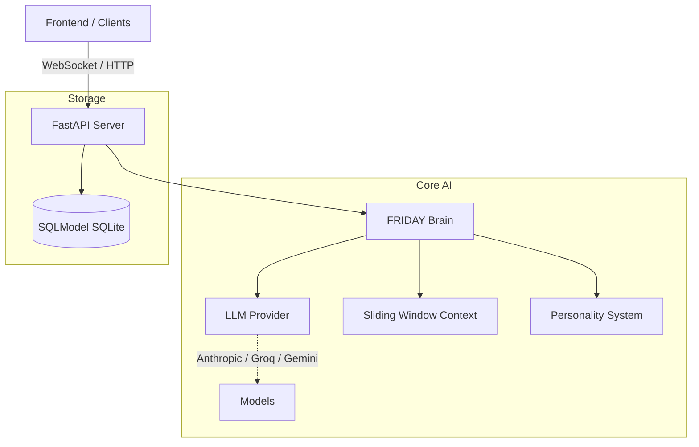

# 🤖 FRIDAY AI Agent

> **F**emale **R**eplacement **I**ntelligent **D**igital **A**ssistant **Y**ield  
> Inspired by Tony Stark's AI from Iron Man.

FRIDAY is designed to be a fully autonomous, voice-activated, memory-driven, tool-wielding personal AI. Currently in **Phase 1** of development, FRIDAY features a robust, streaming LLM brain built on FastAPI and SQLModel, supporting multiple providers (Anthropic, Groq, Gemini).

---

## 🏗️ Architecture



### Current Stack
- **Backend:** FastAPI, SQLModel, Uvicorn
- **AI Brain:** Multi-provider support (Anthropic, Groq, Google Gemini) via official SDKs.
- **Frontend:** React / Vite (Work in Progress)

---

## 🚀 Quickstart

1. **Environment Setup**
   ```bash
   python -m venv venv
   # Activate venv: .\venv\Scripts\activate
   pip install -r requirements.txt
   ```

2. **Configuration**
   Create a `.env` file in the root directory:
   ```env
   LLM_PROVIDER=groq  # or anthropic, gemini
   LLM_MODEL=llama3-70b-8192
   GROQ_API_KEY=your_key_here
   ```

3. **Run the Backend**
   ```bash
   task backend
   # Or manually: .\venv\Scripts\python -m uvicorn friday.core.brain:app --reload
   ```

---

## 🗺️ Roadmap & Vision

We are building towards a deeply integrated desktop AI that sees what you see and acts on your behalf.

- [x] **Phase 1:** Core LLM Brain, FastAPI backend, sliding window memory.
- [ ] **Phase 2:** LangGraph integration for tool usage (Web Search, File Ops).
- [ ] **Phase 3:** STT / TTS Voice Pipeline (ElevenLabs & faster-whisper).
- [ ] **Phase 4:** Desktop HUD & PC Control Autopilot.

For the full architectural vision, see [docs/architecture_vision.md](docs/architecture_vision.md).

---
*Built with ❤️ — "At your service, Boss."*