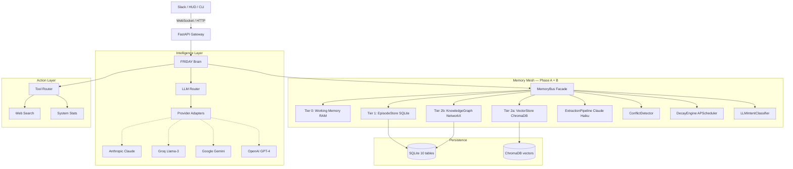

# 🤖 F.R.I.D.A.Y. Agent

[](https://fastapi.tiangolo.com)
[](https://sqlmodel.tiangolo.com)
[](https://www.trychroma.com)
[](https://networkx.org)
[](LICENSE)

> **F**emale **R**eplacement **I**ntelligent **D**igital **A**ssistant **Y**outh  
> *Inspired by the tactical intelligence of the Stark Industries interface.*

FRIDAY is a high-performance, autonomous AI orchestrator built to be the definitive personal digital assistant. She is not a chatbot wrapper. She is a **persistent intelligence** — one that remembers, reasons, detects contradictions, forgets gracefully, and understands what you're really asking.

---

## ✨ Core Features

| Feature | Description |
|---|---|
| 🛡️ **Omni-LLM Orchestration** | Runtime switching between Anthropic, Groq, Gemini, OpenAI with automatic failover |
| ⚖️ **Intelligent Key Rotation** | Unlimited API keys per provider; unhealthy keys sidelined automatically |
| 🧠 **Memory Mesh (Phase A + B)** | Multi-tiered, typed, graph-aware, decay-correct persistent memory |
| 🕸️ **Knowledge Graph** | NetworkX entity graph with multi-hop relational reasoning |
| ⚔️ **Conflict Detector** | LLM-judged contradiction detection with automatic truth maintenance |
| ⏳ **Decay Engine** | Ebbinghaus forgetting curve — FRIDAY forgets what she should forget |
| 🎯 **LLM Intent Classifier** | Claude Haiku classifies query intent with LRU cache for routing precision |
| ⚡ **Real-time Diagnostics** | API health, provider latency, memory stats via natural language |
| 🛠️ **Integrated Tooling** | Web Search, System Monitoring, extensible tool framework |
| 💬 **Slack-First Interface** | Full Socket Mode with streaming replies |

---

## 🏗️ System Architecture



---

## 🧠 Memory System — Phase A + B

FRIDAY's memory is not a vector database with a search wrapper. It is a **living intelligence layer** that operates at four levels simultaneously.

### Memory Tiering

| Tier | Name | Technology | Latency | Scope |
|---|---|---|---|---|
| **0** | Working Memory | Python `deque` (RAM) | <1ms | Session only |
| **1** | Episode Store | SQLite via SQLModel | <10ms | Persistent |
| **2a** | Vector Store | ChromaDB | <100ms | Persistent |
| **2b** | Knowledge Graph | NetworkX + SQLite | <5ms (RAM) | Persistent |

### Memory Formation Pipeline

When a conversation turn completes, FRIDAY fires a **background daemon thread** that runs the full formation pipeline — never blocking the response stream:

```
Raw Conversation Turns
        │
        ▼
┌─────────────────────────────────────────────┐
│  ExtractionPipeline  (Claude Haiku)          │
│  → typed: fact / preference / task /        │
│           relationship / pattern            │
└──────────────┬──────────────────────────────┘
               │
               ▼
┌─────────────────────────────────────────────┐
│  EpisodeStore.save_memory()  (Tier 1)        │
│  SQLite: typed, scored, decay-scheduled     │
└──────────────┬──────────────────────────────┘
               │
               ▼
┌─────────────────────────────────────────────┐
│  VectorStore.upsert_many()  (Tier 2a)        │
│  ChromaDB: embedded for semantic search     │
└──────────────┬──────────────────────────────┘
               │
               ▼
┌─────────────────────────────────────────────┐
│  EntityLinker.link()  (Tier 2b)              │  ← Phase B
│  KnowledgeGraph: upsert nodes + edges       │
│  Infers entity type + relationship type     │
└──────────────┬──────────────────────────────┘
               │
               ▼
┌─────────────────────────────────────────────┐
│  ConflictDetector.scan()                     │  ← Phase B
│  Vector similarity → LLM judge →            │
│  SUPERSESSION / CONTRADICTION / COMPLEMENTARY│
└─────────────────────────────────────────────┘
```

### Memory Retrieval Pipeline

Called **before every LLM invocation** — must be fast. Phase B adds a third parallel path and replaces keyword intent with LLM classification:

```
User Query
    │
    ▼ (LLMIntentClassifier — LRU cached, ~0ms cached / ~200ms cold)
Intent: task | episodic | entity | semantic | predictive | general
    │
    ├──→ Path 1: VectorStore (ChromaDB, top-20 cosine similarity)
    ├──→ Path 2: SQL (preferences + high-importance facts + recent 24h)
    └──→ Path 3: KnowledgeGraph entity boost (ENTITY intent only)
                    │
                    ▼
              Merge + Deduplicate
              (cross-path score boost: +0.15 if found in both)
                    │
                    ▼
              MemoryContext
              ├── facts[]         (top 5, sorted by effective_score)
              ├── preferences[]   (top 5)
              ├── active_tasks[]  (top 5, always SQL)
              ├── entities[]      (KG subgraph card, ENTITY intent)
              ├── conflicts[]     (pending contradiction warnings)
              └── recent_summary  (last 48h episode summary)
                    │
                    ▼
              System Prompt Injection
```

### Memory Decay — Ebbinghaus Forgetting Curve

FRIDAY forgets what she hasn't been reminded of. The `DecayEngine` runs every 24 hours via APScheduler:

```
R(t) = e^(-t / S) × type_decay_rate

Where:
  R = new confidence
  t = elapsed days since last access
  S = stability score (increases with repeated access)
```

| Memory Type | Decay Rate | Natural Half-life |
|---|---|---|
| `fact` | 1.0× | ~1.4 days at stability=2 |
| `episode_ref` | 0.8× | ~1.7 days |
| `preference` | 0.5× | ~2.8 days at stability=10 |
| `pattern` | 0.3× | Weeks |
| `relationship` | 0.25× | Months |
| `task` | **0.0×** | Never — tasks don't forget |

Memories below **15% confidence** are **archived** — kept in SQLite for audit, excluded from retrieval.

### Conflict Detection

When FRIDAY extracts a new memory, `ConflictDetector` checks it against similar existing memories:

1. **Trigger**: cosine similarity > 0.82 with a same-type memory
2. **Judge**: Claude Haiku classifies the pair:
   - `SUPERSESSION` → newer supersedes older (soft-delete older, confidence=1.0)
   - `CONTRADICTION` → record `ConflictRow`, reduce confidence on both to 0.6
   - `COMPLEMENTARY` → no action
3. **Cost control**: max 8 LLM judge calls per extraction batch

### Knowledge Graph

FRIDAY maintains a **NetworkX MultiDiGraph** over named entities:

- **Nodes** → `EntityRow` records (people, projects, tools, concepts, places)
- **Edges** → `RelationshipRow` records (typed: `KNOWS`, `WORKS_ON`, `REPORTS_TO`, `MANAGES`, `USES`, `PART_OF`, etc.)
- **Loaded hot into RAM** at startup from SQLite (~5ms for hundreds of nodes)
- **Reinforcement averaging**: repeated relationship assertions strengthen edge weight
- **Context injection**: for ENTITY-intent queries, injects a formatted entity card into the LLM prompt

```
[ENTITY: Priya]
Type: person | role: manager | last_source: text
Connections: Boss (REPORTS_TO), FRIDAY Project (WORKS_ON)
```

---

## 🚀 Installation

### 1. Clone & Environment
```bash
git clone https://github.com/chaitanya-369/FRIDAY-AGENT.git
cd FRIDAY-AGENT
python -m venv venv
source venv/bin/activate  # Windows: .\venv\Scripts\activate
pip install -r requirements.txt
```

### 2. Configure `.env`
```env
# LLM providers (add as many keys per provider as you want)
GROQ_API_KEY=gsk_...
GEMINI_API_KEY=...
ANTHROPIC_API_KEY=sk-ant-...
OPENAI_API_KEY=sk-...

# Slack integration
SLACK_BOT_TOKEN=xoxb-...
SLACK_APP_TOKEN=xapp-...
SLACK_CHANNEL_ID=#friday-agent

# Memory (all optional — defaults shown)
MEMORY_ENABLED=true
CHROMADB_PATH=data/vectors
MEMORY_EXTRACTION_MODEL=claude-haiku-4-5-20251001
MEMORY_DECAY_INTERVAL_HOURS=24.0
MEMORY_CONFLICT_SIMILARITY_THRESHOLD=0.82
MEMORY_INTENT_CLASSIFIER_ENABLED=true
MEMORY_KG_MAX_NODES=500
```

### 3. Launch
```bash
task backend   # FastAPI + Slack Socket Mode
```

---

## 📁 Project Structure

```
friday/
├── core/
│   ├── brain.py            ← Central orchestrator + Memory integration
│   ├── database.py         ← SQLite engine + table registration
│   └── persona.py          ← System prompt (with memory injection slot)
├── llm/
│   ├── router.py           ← Multi-provider routing + failover
│   ├── adapters/           ← Anthropic, Groq, Gemini, OpenAI, DeepSeek
│   ├── key_pool.py         ← Health-tracked API key rotation
│   └── session.py          ← Active model session
├── memory/                 ← 🧠 Memory Mesh (Phase A + B complete)
│   ├── __init__.py         ← MemoryBus — single public facade
│   ├── types.py            ← Typed primitives (Memory, Task, Entity, etc.)
│   ├── schema.py           ← SQLModel table definitions (10 tables)
│   ├── working.py          ← Tier 0: RAM sliding window
│   ├── episodic.py         ← Tier 1: SQLite CRUD + spaced repetition
│   ├── vector_store.py     ← Tier 2a: ChromaDB semantic search
│   ├── graph.py            ← Tier 2b: KnowledgeGraph (NetworkX + SQLite)  ← Phase B
│   ├── conflict.py         ← ConflictDetector (LLM-judged)                ← Phase B
│   ├── decay.py            ← DecayEngine (Ebbinghaus + APScheduler)        ← Phase B
│   ├── extraction/
│   │   ├── pipeline.py     ← Claude Haiku → typed Memory objects
│   │   └── entity_linker.py← EntityLinker → KG upsert                     ← Phase B
│   └── retrieval/
│       ├── engine.py       ← Multi-modal: vector + SQL + KG
│       └── intent.py       ← LLMIntentClassifier (LRU-cached Haiku)       ← Phase B
└── tools/
    ├── router.py           ← Tool execution framework
    ├── system_stats.py     ← System monitoring
    └── web_search.py       ← DuckDuckGo search
```

---

## 📖 Documentation

| Document | Description |
|---|---|
| [docs/MEMORY.md](docs/MEMORY.md) | Deep technical specification of the Memory Mesh (Phase A + B + C) |
| [docs/VOICE.md](docs/VOICE.md) | Technical specification of the Voice Pipeline (Phase 4) |
| [docs/DEVELOPMENT.md](docs/DEVELOPMENT.md) | Extension guide — tools, adapters, memory, KG, retrieval paths |
| [docs/COMMANDS.md](docs/COMMANDS.md) | Natural language commands reference |
| [docs/architecture_vision.md](docs/architecture_vision.md) | Full project vision and build phase roadmap |
| [DESIGN.md](DESIGN.md) | Visual identity and aesthetic guidelines |

---

## 🗺️ Roadmap

| Phase | Feature | Status |
|---|---|---|
| **Phase 1** | Multi-provider LLM routing + DB-backed unlimited key rotation | ✅ Complete |
| **Phase 2** | Slack Socket Mode with streaming replies | ✅ Complete |
| **Phase 3a** | Memory Mesh Phase A — Typed persistent memory (SQLite + ChromaDB) | ✅ Complete |
| **Phase 3b** | Memory Mesh Phase B — Knowledge Graph + Conflict Detection + Decay Engine + LLM Intent Classifier | ✅ Complete |
| **Phase 3c** | Memory Phase C — Pattern Generalizer + Proactive Preloader + Cloud Archiving | ✅ Complete |
| **Phase 4** | Voice Pipeline — STT, VAD, TTS, Duplex Interruptions | ✅ Complete |
| **Phase 5** | Desktop HUD — Electron/React with real-time memory graph visualization | 🔜 Planned |

---

*Built with precision for the modern Boss.*  
**"At your service."**