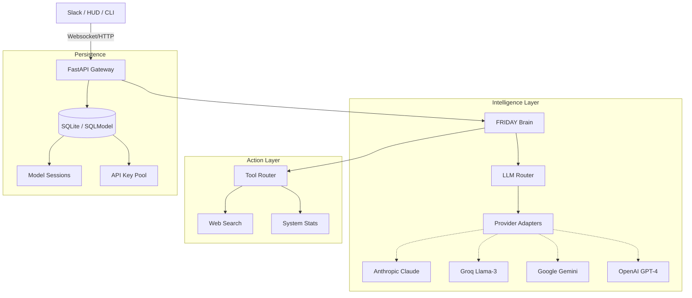

# 🤖 F.R.I.D.A.Y. Agent

[](https://fastapi.tiangolo.com)
[](https://sqlmodel.tiangolo.com)
[](LICENSE)

> **F**emale **R**eplacement **I**ntelligent **D**igital **A**ssistant **Y**outh  
> *Inspired by the tactical intelligence of the Stark Industries interface.*

FRIDAY is a high-performance, autonomous AI orchestrator designed to be the definitive personal digital assistant. Built for speed, reliability, and precision, FRIDAY bridges the gap between static LLM chats and active, tool-wielding intelligence.

---

## ✨ Core Features

- **🛡️ Omni-LLM Orchestration:** Seamlessly switch between **Anthropic**, **Groq**, **Gemini**, and **OpenAI**. 
- **⚖️ Intelligent Routing:** Automatic failover to healthy API keys or local **Ollama** instances when cloud providers are rate-limited.
- **⚡ Real-time Diagnostics:** Full transparency into API health, provider latency, and system status via natural language.
- **🛠️ Integrated Tooling:** Built-in support for Web Search, System Monitoring, and File Operations.
- **💬 Slack-First Interface:** Full Socket Mode integration with streaming replies and interactive HUD elements.
- **🧠 Sliding Window Memory:** Persistent, context-aware memory that grows with your work.

---

## 🏗️ System Architecture



---

## 🚀 Professional Installation

### 1. Clone & Environment
```bash
git clone https://github.com/chaitanya-369/FRIDAY-AGENT.git
cd FRIDAY-AGENT
python -m venv venv
source venv/bin/activate  # Windows: .\venv\Scripts\activate
pip install -r requirements.txt
```

### 2. Configure Your Arsenal
Create a `.env` file with your credentials:
```env
# Core LLM
GROQ_API_KEY=gsk_...
GEMINI_API_KEY=...
ANTHROPIC_API_KEY=sk-ant-...

# Communication
SLACK_BOT_TOKEN=xoxb-...
SLACK_APP_TOKEN=xapp-...
SLACK_CHANNEL_ID=#friday-agent
```

### 3. Ignite the Engine
```bash
task backend  # Launches FastAPI + Slack Interface
```

---

## 📖 Documentation Center

- **[DESIGN.md](DESIGN.md)** - Visual identity, tokens, and aesthetic guidelines.
- **[DEVELOPMENT.md](docs/DEVELOPMENT.md)** - Guide for adding new tools, adapters, or routes.
- **[COMMANDS.md](docs/COMMANDS.md)** - Comprehensive list of natural language commands.
- **[ARCHITECTURE.md](docs/architecture_vision.md)** - Detailed deep-dive into the core logic.

---

## 🗺️ Roadmap

- [x] **Phase 1:** Multi-provider LLM routing & DB-backed key rotation.
- [x] **Phase 2:** Slack Socket Mode integration with streaming support.
- [ ] **Phase 3:** Desktop HUD (Electron/React) with real-time system metrics.
- [ ] **Phase 4:** Voice-activated pipeline (ElevenLabs + Whisper).

---

*Built with precision for the modern Boss.*  
**"At your service."**