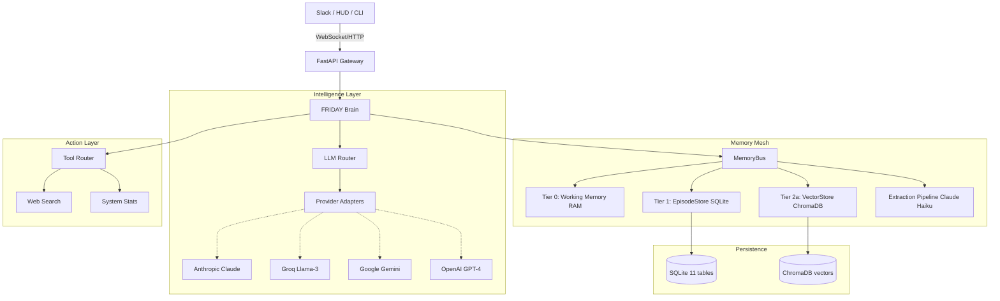

# 🤖 F.R.I.D.A.Y. Agent

[](https://fastapi.tiangolo.com)
[](https://sqlmodel.tiangolo.com)
[](https://www.trychroma.com)
[](LICENSE)

> **F**emale **R**eplacement **I**ntelligent **D**igital **A**ssistant **Y**outh  
> *Inspired by the tactical intelligence of the Stark Industries interface.*

FRIDAY is a high-performance, autonomous AI orchestrator designed to be the definitive personal digital assistant. Built for speed, reliability, and precision — FRIDAY bridges the gap between stateless LLM chat and active, memory-backed, tool-wielding intelligence.

---

## ✨ Core Features

- **🛡️ Omni-LLM Orchestration** — Seamlessly switch between **Anthropic**, **Groq**, **Gemini**, and **OpenAI** at runtime.
- **⚖️ Intelligent Key Rotation** — Automatic failover across unlimited API keys per provider; rate-limited keys are sidelined automatically.
- **🧠 Memory Mesh** — Multi-tiered, typed, confidence-scored persistent memory. FRIDAY remembers facts, preferences, tasks, and relationships across sessions.
- **⚡ Real-time Diagnostics** — Full transparency into API health, provider latency, and system status via natural language.
- **🛠️ Integrated Tooling** — Built-in Web Search, System Monitoring, and a extensible tool framework.
- **💬 Slack-First Interface** — Full Socket Mode integration with streaming replies.

---

## 🏗️ System Architecture



---

## 🧠 Memory System Deep Dive

FRIDAY's memory is not a vector database. It is a **brain**.

Every memory is:
- **Typed** — `fact` / `preference` / `pattern` / `task` / `relationship`
- **Scored** — `confidence`, `importance`, `emotional_valence`, `stability`
- **Versioned** — updates create new versions; old memories are never deleted
- **Decay-correct** — Ebbinghaus forgetting curve with spaced repetition reinforcement

```
User says something
      ↓
[ExtractionPipeline] — Claude Haiku extracts typed memories (async, background)
      ↓
[EpisodeStore] — persisted to SQLite (Tier 1)
[VectorStore]  — embedded in ChromaDB (Tier 2)
      ↓
Next turn: [RetrievalEngine] — parallel vector + SQL search → ranked context
      ↓
[MemoryContext] — injected into FRIDAY's system prompt before LLM call
```

See **[docs/MEMORY.md](docs/MEMORY.md)** for the full technical specification.

---

## 🚀 Installation

### 1. Clone & Environment
```bash
git clone https://github.com/chaitanya-369/FRIDAY-AGENT.git
cd FRIDAY-AGENT
python -m venv venv
source venv/bin/activate  # Windows: .\venv\Scripts\activate
pip install -r requirements.txt
```

### 2. Configure
Create a `.env` file:
```env
# Core LLM providers (add as many keys per provider as you want)
GROQ_API_KEY=gsk_...
GEMINI_API_KEY=...
ANTHROPIC_API_KEY=sk-ant-...
OPENAI_API_KEY=sk-...

# Communication
SLACK_BOT_TOKEN=xoxb-...
SLACK_APP_TOKEN=xapp-...
SLACK_CHANNEL_ID=#friday-agent

# Memory (optional — these are the defaults)
MEMORY_ENABLED=true
CHROMADB_PATH=data/vectors
MEMORY_EXTRACTION_MODEL=claude-haiku-4-5-20251001
```

### 3. Launch
```bash
task backend   # FastAPI + Slack Interface
```

---

## 📁 Project Structure

```
friday/
├── core/
│   ├── brain.py          ← Central intelligence + Memory integration
│   ├── database.py       ← SQLite engine + table registration
│   └── persona.py        ← FRIDAY system prompt (with memory injection slot)
├── llm/
│   ├── router.py         ← Multi-provider LLM routing + failover
│   ├── adapters/         ← Anthropic, Groq, Gemini, OpenAI, DeepSeek adapters
│   ├── key_pool.py       ← Health-tracked API key rotation
│   └── session.py        ← Active model session management
├── memory/               ← 🧠 Memory Mesh (Phase A complete)
│   ├── __init__.py       ← MemoryBus public API
│   ├── types.py          ← Typed primitives
│   ├── schema.py         ← SQLModel tables (6 tables)
│   ├── working.py        ← Tier 0: RAM buffer
│   ├── episodic.py       ← Tier 1: SQLite CRUD
│   ├── vector_store.py   ← Tier 2: ChromaDB
│   ├── extraction/       ← Claude Haiku → typed Memory objects
│   └── retrieval/        ← Multi-modal search engine
└── tools/
    ├── router.py         ← Tool execution framework
    ├── system_stats.py   ← System monitoring
    └── web_search.py     ← DuckDuckGo search
```

---

## 📖 Documentation

| Document | Description |
|---|---|
| [docs/MEMORY.md](docs/MEMORY.md) | Full Memory Mesh specification — architecture, API, schema |
| [docs/DEVELOPMENT.md](docs/DEVELOPMENT.md) | Guide for adding tools, adapters, routes |
| [docs/COMMANDS.md](docs/COMMANDS.md) | Natural language commands reference |
| [docs/architecture_vision.md](docs/architecture_vision.md) | Full project vision and build phases |
| [DESIGN.md](DESIGN.md) | Visual identity and aesthetic guidelines |

---

## 🗺️ Roadmap

- [x] **Phase 1** — Multi-provider LLM routing + DB-backed unlimited key rotation
- [x] **Phase 2** — Slack Socket Mode integration with streaming support
- [x] **Phase 3a** — Memory Mesh Phase A: Typed, scored, persistent memory (SQLite + ChromaDB)
- [ ] **Phase 3b** — Memory Mesh Phase B: Knowledge Graph + Conflict Detection + Decay Engine
- [ ] **Phase 4** — Voice Pipeline (ElevenLabs TTS + Whisper STT + wake-word detection)
- [ ] **Phase 5** — Desktop HUD (Electron/React) with real-time system metrics

---

*Built with precision for the modern Boss.*  
**"At your service."**