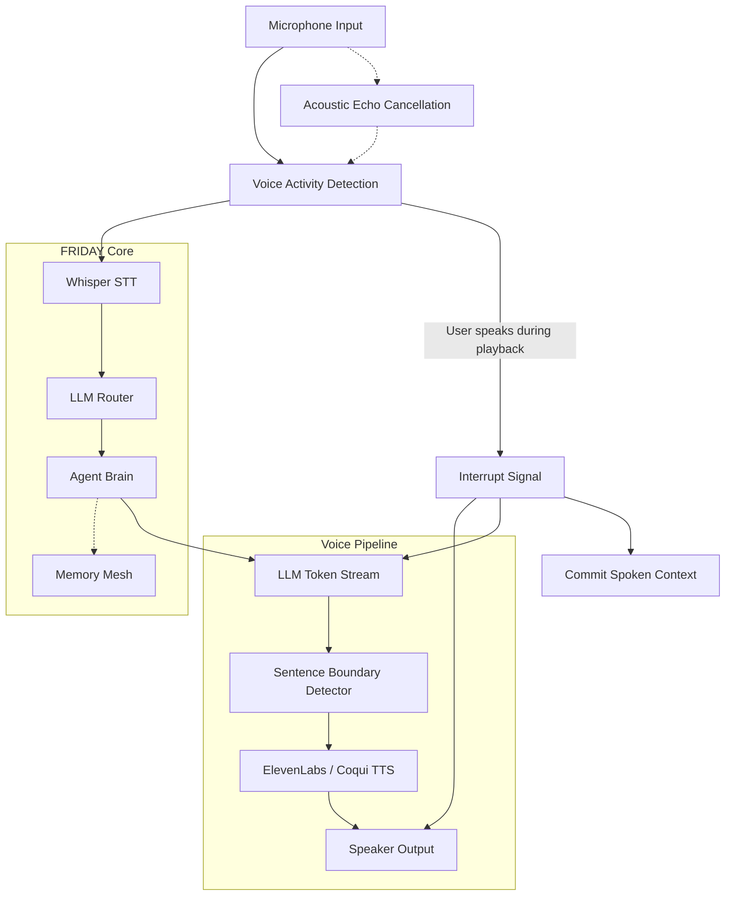

# 🗣️ FRIDAY Voice Pipeline (Phase 4)

The FRIDAY Voice Pipeline provides a real-time, low-latency, and interruptible voice interface, turning the agent into a truly conversational assistant. Inspired by the Stark Industries interface, it enables full duplex (two-way) conversation, allowing the user to interrupt the agent mid-sentence.

---

## 🏗️ Architecture Overview

The voice system is designed around a continuous asynchronous event loop that integrates STT (Speech-to-Text), LLM generation, and TTS (Text-to-Speech) into a seamless streaming experience. 



### Core Components

1. **VAD & Audio Capture**: Uses WebRTC VAD or Silero VAD to detect when the user is speaking. Implements a ring buffer to capture audio immediately prior to the speech trigger.
2. **STT (Speech-to-Text)**: Local Whisper (or cloud-based depending on configuration) converts spoken audio into text with high accuracy.
3. **LLM Generation**: The prompt is processed by the core FRIDAY Brain, which streams tokens back as they are generated.
4. **Sentence Boundary Detection**: Instead of waiting for the full LLM response or synthesizing word-by-word (which sounds robotic), the system buffers tokens into coherent sentences or clauses before sending them to the TTS engine.
5. **TTS (Text-to-Speech)**: Converts the sentence buffers into audio chunks. Supports dynamic failover (e.g., ElevenLabs to a local TTS fallback).
6. **Interrupt Handling**: The most complex subsystem. When VAD detects user speech while audio is playing:
   - Playback is instantly halted.
   - The LLM stream is aborted.
   - The exact context of *what FRIDAY actually managed to say* before being interrupted is committed to the conversation history, preventing hallucinations about what she *intended* to say.

---

## ⚡ Sentence-Level Streaming

To achieve natural prosody and low latency, FRIDAY uses chunked synthesis:

1. As tokens stream in from the LLM, they are concatenated.
2. A regex-based or NLP-based boundary detector checks for end-of-sentence punctuation (`.`, `?`, `!`) or strong clause boundaries.
3. When a boundary is reached, the buffer is dispatched to the TTS engine asynchronously.
4. The TTS engine returns an audio stream which is queued for sequential playback.
5. While chunk `N` is playing, chunk `N+1` is being synthesized, creating a seamless audio output with time-to-first-byte (TTFB) typically under 500ms.

---

## 🛑 The Interrupt Subsystem

Handling interruptions gracefully is what differentiates a standard voicebot from a true assistant.

### 1. Acoustic Echo Cancellation (AEC)
To prevent FRIDAY from hearing her own voice and triggering an interrupt loop, AEC is applied at the audio input level. The system subtracts the known output signal from the microphone input.

### 2. State Machine Coordination
The pipeline operates a strict state machine:
- `LISTENING`: Awaiting user input.
- `PROCESSING`: User has finished speaking; STT/LLM generation is active.
- `SPEAKING`: Audio is actively playing.

If VAD triggers during `SPEAKING`, an `INTERRUPT` event is fired.

### 3. Explicit Memory Commitment
When interrupted, the system calculates exactly which TTS chunks finished playing. It constructs a partial response representing only what was actually spoken out loud. This partial response is added to the dialogue history with an `[INTERRUPTED]` tag, ensuring the LLM understands the exact conversational context.

---

## 🛠️ Configuration & Environment

The Voice Pipeline is configured via the `.env` file:

```env
# Voice Pipeline
VOICE_ENABLED=true
TTS_PROVIDER=elevenlabs # or local
ELEVENLABS_API_KEY=your_key
ELEVENLABS_VOICE_ID=your_voice_id # Default is FRIDAY voice profile
STT_PROVIDER=whisper # local, groq, openai
```

---

## 🚀 Running the Voice Interface

Currently, the voice interface can be launched via the CLI or as a standalone module:

```bash
python voice_launch.py
```

*Note: Future phases will integrate the voice pipeline directly into the HUD (Phase 5).*
